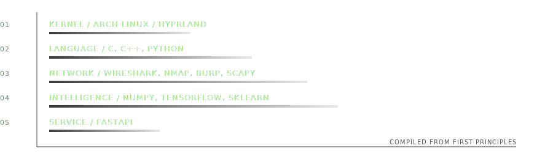

<div align="center">


</div>

<br/>

<table width="100%">
<tr>
<td width="60%" valign="top">

### the short version

I don't trust a tool until I've taken it apart. Six years ago that meant plain HTML. Somewhere along the way it became raw C, then packet captures, then writing a neural net's backward pass by hand because I didn't believe the library until I could derive it myself.

I'm not chasing frameworks. I'm chasing the moment a system stops being magic and starts being *obvious*.

</td>
<td width="40%" valign="top">

### currently

```
location   arch + hyprland
uptime     2 years, no crashes worth mentioning
building   mnist net, numpy only
reading    packets before I read docs
mood       curious, mildly reckless
```

</td>
</tr>
</table>

<br/>

<div align="center">

### the stack, bottom up

<picture>
  <source media="(prefers-color-scheme: dark)" srcset="assets/stack-dark.svg">
  <source media="(prefers-color-scheme: light)" srcset="assets/stack-light.svg">
  
</picture>

</div>

<br/>

<div align="center">

### field notes

</div>

- Spent two years living inside Linux internals before trusting myself to build anything on top of it.
- Read networks the way most people read documentation — Wireshark, Nmap, Burp Suite, Scapy, Ettercap, line by line.
- Currently rebuilding a neural net from raw NumPy math, no `model.fit()`, because I wanted to feel the gradients move.
- Backend work happens in FastAPI once the theory checks out — not before.

<br/>

<div align="center">


<br/><br/>

<a href="https://linkedin.com/in/saksham-yadav-684042378"></a>
<a href="https://twitter.com/sakxamydv"></a>
<a href="mailto:sakxamydv@gmail.com"></a>
<a href="https://www.kaggle.com/sakxamydv"></a>
&nbsp;·&nbsp;
<a href="https://www.sakshamyadav.info.np/"><sub>sakshamyadav.info.np</sub></a>

</div>

<br/>

<div align="center">
<sub>curiosity, a little madness, and everything rebuilt from scratch.</sub>
</div>
