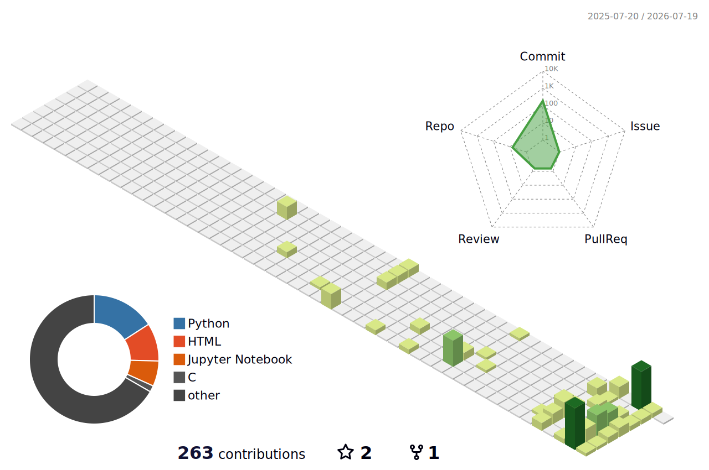

<div align="center">


<div>
### 🏙️ My 3D Contribution City
<p align="center">
  
</p>

### 🌆 My GitHub Skyline
<p align="center">
  
</p>
</p>

### 🏙️ My 3D Contribution City
<p align="center">
  
</p>


  
</div>
<br/>


</div>

[

<br/>

## 01 — WHO

I break systems down until they stop being mysterious, then rebuild them from scratch. Six years ago that meant basic web pages. Today it means writing neural networks in raw NumPy and reading packets off the wire in Wireshark.

No shortcuts, no black boxes. If I can't explain how it works, I haven't learned it yet.

<br/>

## 02 — WHAT I'M DOING NOW

```
> designing an MNIST classifier from raw NumPy — no Keras, no shortcuts
> studying backend architecture patterns for high-throughput systems
> mapping network layers with Wireshark, Nmap, Burp Suite, Scapy, Ettercap
> living inside Arch + Hyprland, two years and counting
```

<br/>

## 03 — STACK

<div align="center">

| Layer | Tools |
|---|---|
| **Languages** | Python · C · C++ |
| **Backend** | FastAPI |
| **ML / DL** | NumPy · TensorFlow · Scikit-Learn |
| **Security** | Wireshark · Nmap · Burp Suite · Scapy · Ettercap |
| **Environment** | Arch Linux · Hyprland · Ubuntu |

</div>

<br/>

### 🛠️ Tech Stack & Tools

<p align="left">


<!-- Frameworks & Data Science -->


<!-- Systems & Networking -->


</p>


## 04 — ACTIVITY

<div align="center">


</div>

<br/>

## TOP LANGS
<div>
  
  
  
</div>

## 05 — REACH ME

<div align="center">

<a href="https://linkedin.com/in/saksham-yadav-684042378"></a>
<a href="https://twitter.com/sakxamydv"></a>
<a href="mailto:sakxamydv@gmail.com"></a>
<a href="https://www.kaggle.com/sakxamydv"></a>

**site:** [sakshamyadav.info.np](https://www.sakshamyadav.info.np/)

</div>

<br/>

<div align="center">
<sub>curiosity, a little madness, and a lot of first principles.</sub>
</div>
