 

  
  
  

## ⚔️ Two Sworn Companions Ride With Me ⚔️

<table>
<tr>
<td align="center" width="50%">

 <b>Ser Committer, Shield of the Main Branch</b>
</td>
<td align="center" width="50%">

 <b>The Bug-Eater, Breather of Deploy-Fire</b>
</td>
</tr>
</table>

---

## 🏰 About This Realm

> *"In this House, we do not fear the merge conflict — we ride into it."*

- 🗡️ Currently working in **`MNIST-Neural-Network-From-Scratch`**
- 🛡️ Skilled in the old arts of **`DL`**, **`PYTHON`**, **`FAST API`**
- 🔥 Studying **`BACKEND & ML`**
- 📜 Reachable by raven: **sakxamydv@gmail.com**

 

## ⚜️ Sigils & Bannermen (Tech Stack)

  
  
  
  
  
  
  
  
  
  
  
  
  

## 🩸 War Record (GitHub Stats)

---

## 🔥 Siege Engine Status (CI / Deploy)

  
  
  
  

---

## 🐍 The Serpent's Crawl (Contribution Graph)

<i>This animates via a GitHub Action —
<a href="https://github.com/Platane/snk">setup instructions here</a>. Until you add the workflow, this image will 404.</i>

---

## 🏹 Bannermen I Ride With (Socials)

  
  
  

  

🔥 *"Fire cannot kill a dragon — and merge conflicts cannot kill a knight."* 🔥

