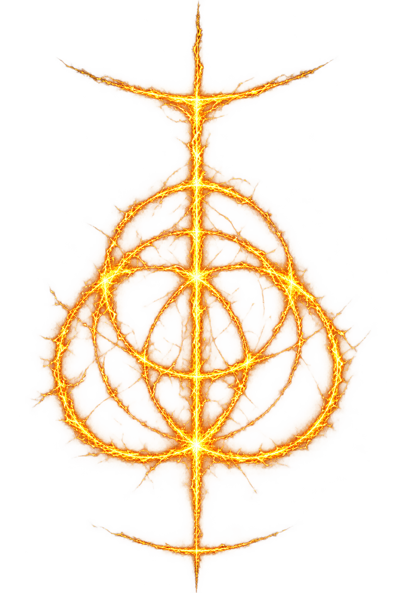

<div align="center">


----------------------------------------------------------------------------------------





                                                                                                                                                        
                                                                                                                                                        
                                                                                                                                                        
                                                                                                                                                        
                                                                                                                                                        
                                                                                                                                                        
                                                                                                                                                        
                                                                                                                                                        
                                                                                                                                                        
                                                                                                                                                        
                                                                                                                                                        
                                                                     ‚  ·‹‚                                                                             
                                                              ‚                                                                                         
                                                         ­‘˜¨                                                                                           
                                                       ¹’                             ·˜¡                                                               
                                                     ”‘`                                 ·¹                                                             
                                                   ï’                                       ¸l                                                          
                                                   ²                                          t                                                         
                                                 l;                   ¨…˜‚’˜;:·´`             `°                                                        
                                                ’·             …’›³¡¿1¼óöòn@@I>*¡“³;ˆ´         ·ª                                                       
                                                ·        ·­›º«1töÌù¾ShÇàûûh9U4©ó‰tr>(¦’¨        ‹                                                       
                                                ˜      …°?†ƒL5xU®ûäDÖ$$ëÞÒZhÝOõùLós¼Iì/‹…       ˜                                                       
                                                ˆ     ·»c%ó&¾µ9ÇäáDZ¥¥FF¥FPh®Tfôù£3@¼¤I>³´      ‚                                                       
                                                ’     :zV©&¾U®äᥥbZš¥ZPÒÖÖÖÖÖF§x&ùÍ@‡ƒƒ>˜      ‚                                                       
                                                t    ¸<£™õxSPÒÓëÓëÜëýë$ÚÜÖZášTó=)»/¬*lo¤t(‘´    ‚                                                       
                                                 ’   ‘nüõxxxUTkšSÝ¥ÿÒ¥Zûxƒ˜´    ·˜­º°’‘¿tv*ˆ    ¸                                                       
                                                 I`  ’¢L%„¸`    ·­oYxy4Y½[›˜·’/ì1<(*v¼¤¿í17³    ·                                                       
                                                 4·  ;c¯’|ìz¢ƒ¦ˆˆ’³cOZÇ4t;…´ˆ»­‘…’¦÷|?Jó±‰1¡´   ‘                                                       
                                                 ±…  :ƒ}¤ì»ïî<“…’…ˆ^çÇUùJ/|ˆ²f‘  ­)¬[c¼±L¢î/·  ˆ­²^                                                     
                                                  i¨`‘V¼1÷ˆ–/´ `u»>LÝ¥h5£±n½=j>¿*i%óç2ùLL@z?’·›»)„*                                                     
                                                  Ö’´’xUy2ónIl/†‡5USÖøýšx™çõTàûÝ®SSkÝSy&&£@l¹’+½33òò                                                    
                                                 9»/‚­xS®9Tx6TÝFÖ¥ÝÿGpÚD§Sž5xFÜÚÜÚÜýÿš®ef£nl—’‚³IYÍò                                                    
                                                 L³?ó+fP¥ÖÞýÜøøøÓÒåkTf£óLùü£õ06Ç¥ýýÖPÝ®eôÍzi|³rzoY±ó                                                    
                                                 Í[&&î&býÜ8øø88dS¿’‚º¯ª:³)?¡‹j£ÍÍùõ44õ™ç0s1(º’¯3磩z                                                    
                                                  óõò†£PÞÞÖÖÒÖÖÿšSV+¹’’³­;–¦*u5õ͉¼uöó3±Ì‡[“‚‘>±ô&£J                                                    
                                                  ùôLIÏT®žUUTUUžOt‹‚~7z±ój¬|‹”¬¬}*¿t½nó¢c)­˜¸ˆ|©õ©t                                                     
                                                  *y©n¿Lùôxxyù1ªˆ³)?(?¿[7*÷°›­‚ˆ¨`·|¼ò½l÷:¸´                                                            
                                                   eU£¹vtó5¾0°´` ¨^3TááFD9&ó‰1”’…’’“}=i|;…`                                                             
                                                   /=¬`—†>ÏxY–’—*s&faϼccI¤rcƒó™™ó¤î</º’…                                                               
                                                        ›³)z£öòùUž4ní?††iì=zçõxõùnî?”’·´                                                                
                                                         ·‘„[¼ùOžSÇšhSU96yµU¾õõùσ?~˜…`                                                                 
                                                          `¸“7sxµ§h®àšÝU6õ&2ù5Yòî*”‘¸´                                                                  
                                                            ·°^<ó@orv1l>¿)(÷—“–°­’·`     ·…                                                             
                                                               ´…’˜’‚……¸·¨`            `ˆ:‘                                                             
                                                            ‚                         ¸­”~¹                                                             
                                                            ­¦³·                   `·’³÷¬¦¹                                                             
                                                            :/{/„›ˆ´          ´·…¸ˆ’¹ª¬/+|¹                                                             
                                                            …[lîr<)÷“¹’ˆ…··…ˆ’‚‚’;­³—/}[[«º                                                             
                                                            ·>tz¢½î7)|”°‘‚’’’‚‘;­º^•*>lìi/„                                                             
                                                            `†ò£YYÏz=}|³›:;‹;:°³„|}>1crj=/”`                                                            
                                                             ^ó™4OO50sj}»|¬«•¬/)}ìc¼ò½ƒv?/›·`                                                           
                                                          ·  ’t&eݚǧS¾ù0V03@ò‰¢óV£VLò¤ï¬:‚’’…                                                          
                                                         ´’­–­ªIÍxûššääšûÝûžy5©£©©Vóƒ¿~›::::‘‚…                                                         
                                                     ¨’:;‹²”^¯¦«71zçµS9®®žžy5&磢r»­¹‹‹‹¹­‹›:’‚˜ˆ¸·´                                                    
                                                 :²³³~““³³~„¯¡¬¬/+?7iiií%¢Í0I/ª”„”³³²––²²°­‹›:‘’::::;:‘¸¨                                               
                                             :°“ª¦¦¡÷¦¯—ª„ª—¦|•(+++//¬¬|«|——“~ª„^—ª“~~“~º²­¹›‹¹­­­­­­º³º–­;’´                                           
                                         ­÷!!¬¬|||•///•|÷¯¯¯÷¬/*}??????(|¦+|ª¬»«¬÷¯ª„ª^„º°­°–º³³~³³³³„„„^^ª„~²­¹’¨                                      
                                    ­¬ì?*}*}*»|¬)?><[)»¬¬¬¬|¬«/*¿[[¿?}/¬|ª)¦¯|¬|¡÷¦¯¯¯^~³„””„—^^¯¯„”—÷¦—¦¦¦¦¦—¯¦¯„“–‹˜                                  
                                ±oli>i><<[>[•¬/i>1rr†(/»«»»////••)/«•¬¬¬|¯~”¦¬/{«|||¡÷÷¯¦¡¦¦¡¡÷÷¡|¡÷¦¬••¡¬¬¬¬¬|¬•¬¬|¡¦¦^”°;                             
                            ^1¤rï[[[=r‡zrl*|¬>îo‡ƒIîï¿}+*}>l1cƒti(/«•»/»*îss@s‰sï)¿[¿**)*//«/¬|¬•««¬|«+[/¬////»•»/////«»/»¬¬ª­                          
                          )‡o<>[?<rƒ¢s½ri•¡/1r%u‰J%tî=>írtz¢óóLÍÏn‡í{///ït%J¤vvrîò‰zIt¤%tror1===íì†(//7=>«•?7?[/i[¿[[†¿*+***{)(¬²                       
                        °‰Lzi>>i1‡óLLó%*^¬lrt¼uuz¤%zz%I%z½öL©™™™™™&&™©ózsuuóóÍ£±òóó±LLóuz%zzƒƒttJzî7¿[=cI=//vrlv7ìllrl=7?}}}?}*ƒ‰I1º                    
                       [òó̇[íjtsL0£Ïƒ÷„}¤tIòóò‰‡½öö@ò¢¢söÏ£™&&ùùüô4¾¾a£ùa4x4xõ±Ì0©ù©YLó@¢su‰¼‰s@@‡cl=rz¼¤>»/jrtƒ=%½‡ƒ%Iîl>>i[+I‡‰zv“                   
                     ²c‰unóz<czs±£YVr„¯I½tzÏ0VLL0£VLLÏóó@óLùa&&üüüaaôõüaôôü3a&Yó0çùùùù©LóóóÏ@ööóLLC¼crtz½‡t*/r¼I½%tö@óóÌószƒ%oIƒ¤orr[–                  
                    ìtƒJ½ò@uc%s±Yç3†„|‰sJó£ü&&™™çç£VVVLÏϱ£™&ô&ôôô55ô&ùôùÍ󃣣ÍÏ0©ùùù™£L±Ï3LÏóó3Vç£ó¼Ircz¼¤>(*zz¼LzJ3LLL±33@‰o‰½ƒjllv7“                 
                   rzzto¼ó3Ìt¼Ï£0ó(¦+Ïó½L™&55ô&™©££££££VV£ùa&ôôô5õ4õ5aùaü0sIsùYÍÍ£©ù™ù£±ÏÏLLL3ÏÏVùù©Ì‡vt¼‰%ìzrtƒ‰£V¼sV00££©Ïztzö@ƒl>ív=!‹               
                 “i1tƒvînLLÏöJ30n[|*3ós0ó3£ù&a磣YY©ùù©©©ùü&ôôôô55555üçô44xµTy©Ì3Yüaaù©3óV£VÍL3Í£ù™™©3zƒz¢r*ö0@%@özozu£0V£™£%î=sÍó%ì[iïí*º              
                »rtrII>IL©LÌöczuî}l3L3óv%3V©ùùùùùùùù™aaaa&ô5õ5555ô&aù0£&4OU9SyùÏÍüô&5&0ÌÌLÍÍÍÍÍÍV©™™ùùVósöï{óYVuL‡I*ívöVVYù@ío=z3Ìu1[*?>l[}             


<br/>
<br/>


</div>

<br/>

## 01 — WHO

Hi, I am Saksham Yadav

Just a guy who wants to learn everything from First Principles. I started my coding journey about 6 years ago with basic HTML and CSS, built a few static websites, and then shifted my focus to learning and mastering the fundamentals of C.

I have a deep understanding of Python, C, and Linux, which I used as my main OS for 2 years straight (Ubuntu & Arch with Hyprland). During that time, I explored Cybersecurity and Networking, getting hands on with tools like Wireshark, Burp Suite, Nmap, John the Ripper, Metasploit, Scapy, Ettercap, and the OSINT Framework. I've studied and practiced concepts like XSS, AuthN & AuthZ, SQLi, RATs, Reverse Shells, MitM, Session token theft, Subnetting, OSI model, TCP/UDP, ARP poisoning, and Encapsulation.

And Right Now, I am mastering BACKEND and ML/DL/NLP/CV To make the best out of both.
<br/>


  
</div>

## 03 — WHAT I'M DOING NOW

```
> designing an MNIST classifier from raw NumPy — no Keras, no shortcuts
> studying backend architecture patterns for high-throughput systems
> mapping network layers with Wireshark, Nmap, Burp Suite, Scapy, Ettercap
> living inside Arch + Hyprland, two years and counting
```

<br/>

## 04 — STACK

<div align="center">

| Layer | Tools |
|---|---|
| **Languages** | Python · C · C++ |
| **Backend** | FastAPI |
| **ML / DL** | NumPy · TensorFlow · Scikit-Learn |
| **Security** | Wireshark · Nmap · Burp Suite · Scapy · Ettercap |
| **Environment** | Arch Linux · Hyprland · Ubuntu |

</div>
<br/>
<p align="left">


<!-- Frameworks & Data Science -->


<!-- Systems & Networking -->


</p>


## 05 — ACTIVITY

<div align="center">


</div>

<br/>


## 06 — REACH ME

<div align="center">

<a href="https://linkedin.com/in/saksham-yadav-684042378"></a>
<a href="https://twitter.com/sakxamydv"></a>
<a href="mailto:sakxamydv@gmail.com"></a>
<a href="https://www.kaggle.com/sakxamydv"></a>

**site:** [sakshamyadav.info.np](https://www.sakshamyadav.info.np/)

</div>

<br/>

<div align="center">
<sub>curiosity, a little madness, and a lot of first principles.</sub>
</div>
